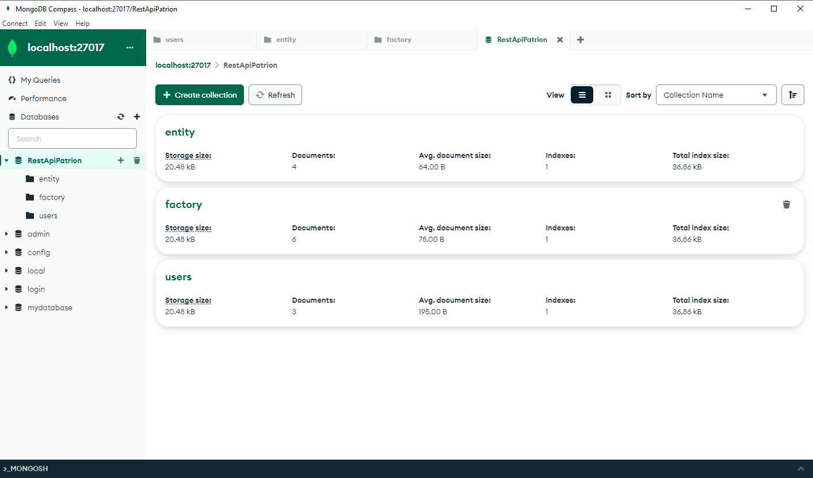

# Project Name

PATRION REST API

### Requirements

What you need to install the software and how to install them:

- Python (version 3.x)
- MongoDB
- Virtual Environment (optional but recommended)

### Installation

Step-by-step examples to set up your development environment:

1. **Clone the repository:**
    ```bash
    git clone <repository-url>
    cd <repository-directory>
    ```

2. **Create a virtual environment (optional but recommended):**
    ```bash
    python -m venv venv
    ```

3. **Activate the virtual environment:**
    - **For Windows:**
      ```bash
      venv\Scripts\activate
      ```
    - **For Mac/Linux:**
      ```bash
      source venv/bin/activate
      ```

4. **Install dependencies:**
    ```bash
    pip install -r requirements.txt
    ```

5. **Install and start MongoDB:**
    - If MongoDB is not installed, install it.
    - Start the MongoDB service.

6. **Configure environment variables:**
    Create a `.env` file in the root directory and add the following variables:
    ```env
    MONGO_URI=<your-mongodb-uri>
    MONGO_DBNAME=mydatabase
    JWT_SECRET_KEY=<your-jwt-secret-key>
    ```

### Running the Application

1. **Start the Flask application:**
    ```bash
    flask run
    ```

2. **Access the API:**
    - The API is accessible by default at `http://localhost:5000`.
    - You can interact with the API endpoints using `curl`, `Postman`, or a web browser.

## Usage

Explain how to use your project. Include examples where necessary.

## API Endpoints

Describe your API endpoints here with examples and expected responses.

### Create Factory

- **URL:** `/factories`
- **Method:** `POST`
- **Headers:** `Authorization: Bearer <jwt-token>`
- **Body:**
  ```json
  {
    "name": "Factory Name",
    "location": "Factory Location",
    "capacity": 100
  }

